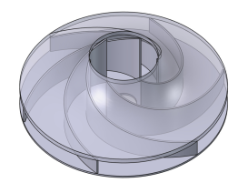

# impeller-fc-json

_Intent is to use generated curve equations to model the blades and shroud of an impeller with a flat hub in FreeCAD, via JSON import into the Parametric_Curve_FP macro._

A Python script calculates optimized impeller blade curve equations based on maximum inlet height, inlet and outlet radius, number of blades, and blade thickness. The curve equations are written to a JSON file in a format compatible with the Parametric_Curve_FP macro.

### Credit where Credit is Due:
The original code for this application was generated by [Google Antigravity](http://antigravity.google/).  _Thank you!_
